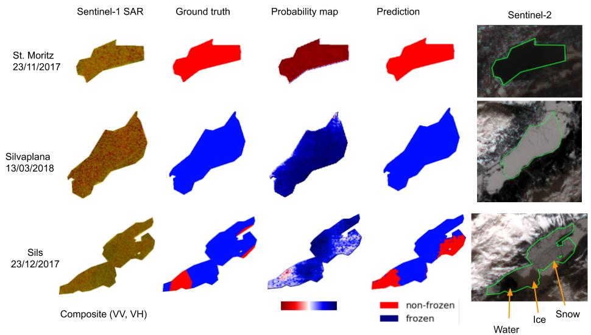

# Lake Ice Detection from Sentinel-1 SAR with Deep Learning

This repository contains the source code and pretrained models corresponding to the paper [Lake Ice Detection from Sentinel-1 SAR with Deep Learning](https://arxiv.org/pdf/2002.07040.pdf) (accepted for ISPRS Congress, 2020, Nice, France), 
Roberto Aguilar, Manu Tom, Pascal Imhof, Silvan Leinss, Emmanuel Baltsavias, Konrad Schindler

## Methodology
* Deep learning for SAR Sentinel-1 semantic segmentation is based on [Deeplab v3+](https://arxiv.org/abs/1706.05587).

* Rasters correspinging to Sentinel 1 were downloaded from [Google Earth Engine](https://earthengine.google.com/)

## Dependencies

The required libraries can be installed by running
> pip install -r requirements.txt

## To run a validation test with existing dataset:

> cd models/research/deeplab
> bash train_and_val_sar_ice.sh 2016_17_2017_18_vv_vh_sils_silvaplana_stmoritz_2016_17 2016_17_regionsils mobilenet_v2 V
-----
Takes ~30 min on GPU Quadro M1200
Results are stored in models/research/deeplab/datasets/sar_ice/exp_2016_17_regionsils

### Sample dataset

A sample dataset 2016_17_2017_18_vv_vh_sils_silvaplana_stmoritz_2016_17 is provided in models/research/deeplab/datasets/sar_ice. It name follows this convention:
\<winter1\>\_\<winter2\>\_\<band1\>\_\<band2\>\<lake1\>\_\<lake2\>\_\<lanen\>\_\<validationset\>

It was generated with the script data_scripting/preprocessing_sar.ipynb and in split in the following folders:

- dataset_2016_17_2017_18_vv_vh_sils_silvaplana_stmoritz_2016_17
    - ImageSets: training and validation file list
    - JPEG images: RGB composite with SAR images, VV -> red, VH -> green
    - SegmentationClass: pixel-wise ground truth. non-frozen -> red, frozen -> blue, background -> white
- tfrecord_2016_17_2017_18_vv_vh_sils_silvaplana_stmoritz_2016_17

## To train a model with an existing dataset (tested on GeForceGTX1080Ti):

> bash train_and_val_sar_ice.sh 2016_17_2017_18_vv_vh_sils_silvaplana_stmoritz_2016_17 2016_17_regionsils mobilenet_v2 TV 0.001 40000 1 8 129
-----
Takes ~8 hours on GeForceGTX1080Ti

## To generate a new dataset:
> Download images from https://polybox.ethz.ch/index.php/s/AjRHiOQhvf0vrku
> Place sentinel1 folder into data/rasters/
> Open data_scripting/preprocessing_sar.ipynb
> Configure winter and lakes for training and validation set
> Update models/research/deeplab/datasets/segmentation_dataset.py

## Download from Google Earth Engine

Example for downloading Sils lake images for winter 2017-18 with VV available on: https://code.earthengine.google.com/?scriptPath=users%2Frobertoaguilar%2Flakeice%3Asentinel1. It requires a Google Earth Engine account to be accessed.

* To download several images, run the script data_scripting/gee_browser.js on the browser once GEE tasks are ready after running the downloading script.

###Citation
Kindly cite our paper, if you use this repo:

@inproceedings{tom_aguilar_2020:isprs, author={Tom, M. and Aguilar, R. and Imhof, P. and Leinss, S. and Baltsavias, E. and Schindler, K.}, booktitle={ISPRS Congress}, title={Lake Ice Detection from Sentinel-1 SAR with Deep Learning}, year={2020}, }
